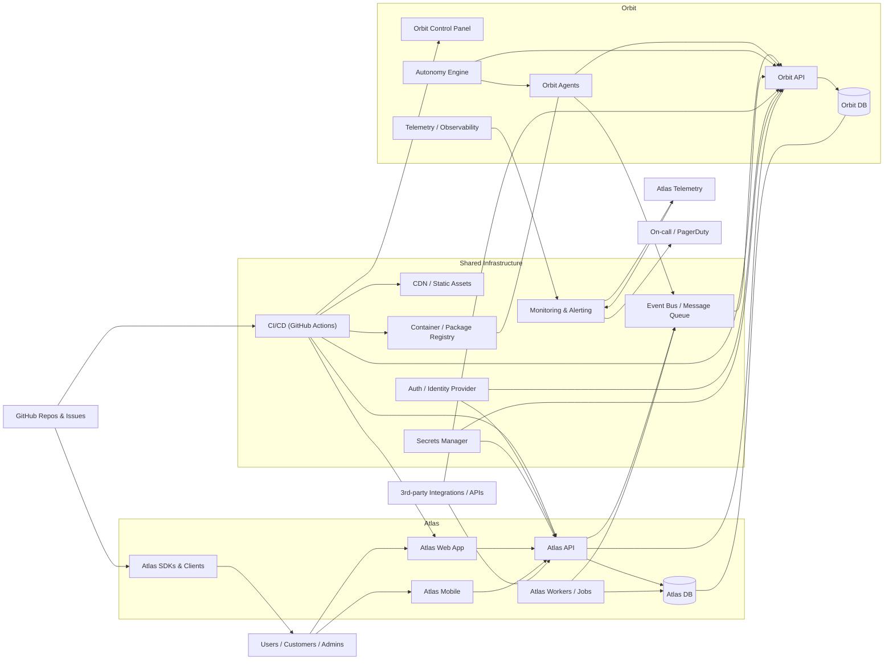

# Welcome to Atlas-Orbit 🛰️

Atlas-Orbit is building the next generation of open operations infrastructure, focusing on seamless integration, intelligent coordination, and living documentation for distributed systems.

## Our Ecosystem

### 🌐 Core Projects

- **[Orbit](https://github.com/Atlas-Orbit/orbit)** — The living documentation and repo-context layer for the Atlas & Orbit ecosystem. Serving as the knowledge foundation for our entire platform.

- **[OpenOps Core - Interlink](https://github.com/Atlas-Orbit/openops-core-interlink)** — The foundational interlink project for OpenOps Core. Building the bridges between systems.

- **[Control Tower MCP](https://github.com/Atlas-Orbit/control-tower-mcp)** — A governed MCP bridge connecting work-trackers, GitHub Projects, Linear, manifests, receipts, and enabling agent-agnosti[...]

- **[Demo Repository](https://github.com/Atlas-Orbit/demo-repository)** — Showcasing the best GitHub has to offer.

### 📋 Templates & Resources

- **[Repository Template](https://github.com/Atlas-Orbit/repo-template)** — A starter template for creating new repositories within the Atlas-Orbit ecosystem.

## Architecture: Atlas & Orbit ecosystem

This diagram shows the high-level components and interactions across the Atlas and Orbit subsystems.

## What We're Building

Atlas-Orbit focuses on:

- 🔗 **Interoperability** — Seamless connections between tools and platforms
- 📚 **Documentation** — Living docs that stay in sync with code and systems
- 🤖 **Intelligence** — Agent-agnostic coordination and automation
- 🏗️ **Infrastructure** — Open, governed, and extensible systems

## Getting Started

All repositories in Atlas-Orbit are currently private. To get involved:

1. Check out the [Orbit documentation](https://github.com/Atlas-Orbit/orbit) for project context and architecture
2. Review our [repository template](https://github.com/Atlas-Orbit/repo-template) for our standards
3. Reach out to the team to learn about contribution opportunities

## Contributing

We welcome contributions! For details on how to contribute to any Atlas-Orbit project, please check the individual repository's `CONTRIBUTING.md` file.

---

**Atlas-Orbit** — _Building the future of open operations infrastructure_
